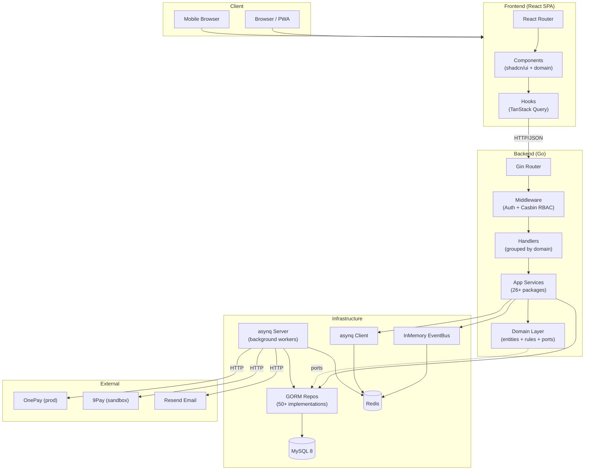
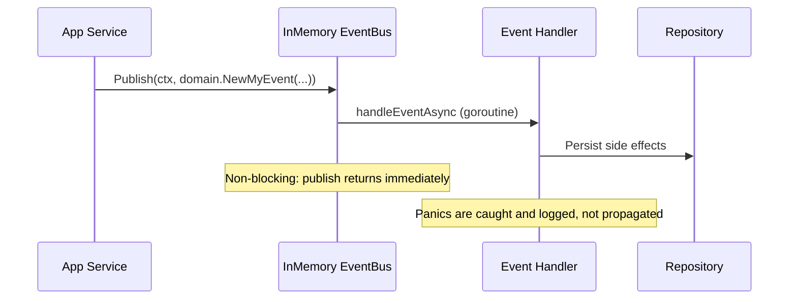
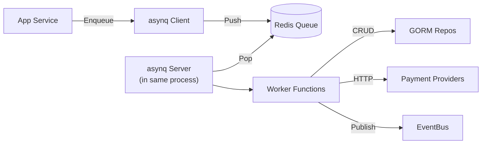
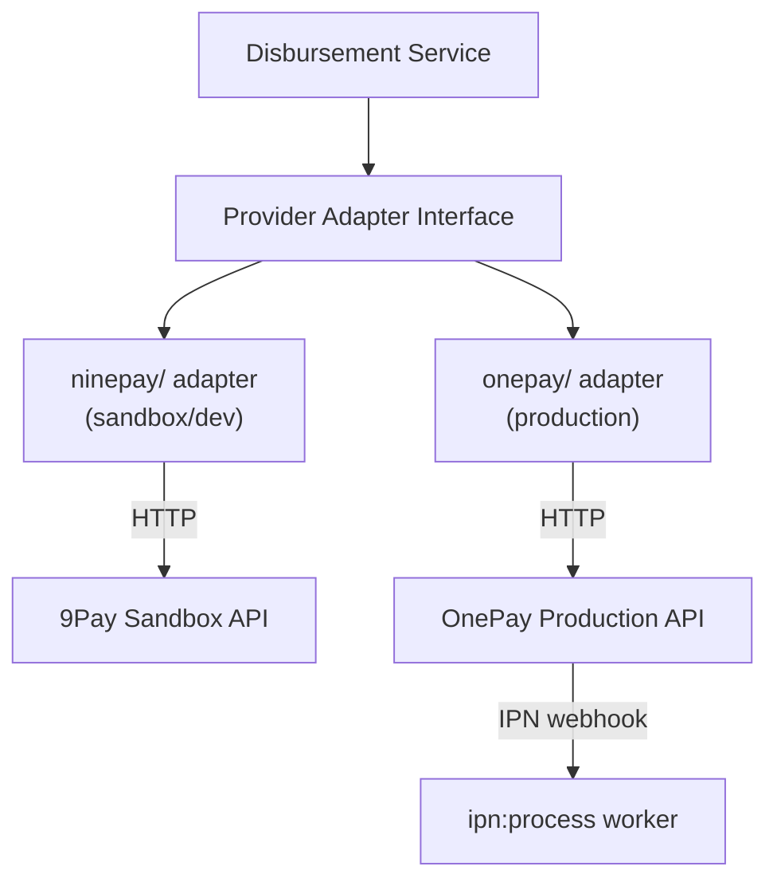

# System Architecture

Component relationships, request flows, and infrastructure topology for the payroll monorepo.

## Component Overview



## Request Flow

```
Browser → Gin Router → Middleware chain → Handler → App Service → Domain Service → Repository → GORM → MySQL
```

### Middleware Chain (in order)

1. **Security headers** -- XSS protection, content-type options, frame deny
2. **Request timeout** -- Enforces max request duration
3. **Rate limiting** -- Per-endpoint rate limits via Redis
4. **Auth (JWT)** -- Extracts and validates JWT token, sets user ID/role in Gin context
5. **Authorization (Casbin RBAC)** -- Checks user role against `casbin_policy.csv` rules
6. **Audit context** -- Sets up audit logging context
7. **Partner scoping** -- For Partner/AdvPartner roles, enforces project-level access control

### Handler Pattern

Each handler receives services via constructor injection (wired in bootstrap/container.go). Handlers parse requests, call app services, return standardized JSON responses.

```go
type MyHandler struct {
    myService    *services.MyService
    auditService *infrastructure.AuditService
}
```

## Event / Outbox Flow

The system uses an **in-memory EventBus** (not Redis streams despite earlier architecture notes). Events are published synchronously to registered handlers, but handlers execute asynchronously via goroutines.



Event registration uses `Subscribe(eventType, handler)` for typed events or `SubscribeAll(handler)` for global handlers.

Domain events are defined in `internal/domain/events.go` with typed event factories in `event_factory_*.go` files.

## Async Job Flow (asynq)

Background jobs use [asynq](https://github.com/hibiken/asynq) with Redis as the task queue. The asynq server is embedded in the api-server process.



Key task types (from `internal/infra/asynq/handlers.go`):

| Task Type | Worker | Triggers |
|-----------|--------|----------|
| `import:job` | BCC file import processing | Admin uploads BCC file |
| `employee:import` | STK bank account import | Admin uploads STK file |
| `ipn:process` | Payment IPN handling | Webhook from OnePay/9Pay |
| `disbursement:execute` | Single disbursement | Advance payment approved |
| `disbursement:poller` | Status polling | Periodic cron-like check |
| `bulk_transfer:ninepay_execute` | 9Pay bulk batch | Bulk transfer initiated |
| `bulk_transfer:transaction` | Revenue transaction creation | Bulk transfer result uploaded |
| `bulk_transfer:payment` | Payment status update | Bulk transfer result uploaded |

## Caching Layer

Redis is used for:
- **asynq task queues** -- Background job processing
- **Application caching** -- Cache invalidation after commits
- **Rate limiting** -- Per-endpoint request counts

Cache invalidation is triggered after database commits to keep cache coherent with source of truth.

## Payment Provider Integration

The system is provider-agnostic with adapters in `internal/infra/disbursement/`:



- Production uses **OnePay** exclusively
- Sandbox/dev uses **9Pay** mock server (runs at localhost:9001 in dev compose)
- OnePay mock also available at localhost:9002
- IPN webhooks have IP whitelist enforcement via middleware
- Fee is charged only at transfer execution (zero on preflight)

## Auth & RBAC

### Authentication

JWT tokens issued on login. Middleware extracts token from `Authorization: Bearer <token>` header, validates, and injects user ID and role into Gin context.

**Self-service password reset:** Users with an email on file can request a single-use magic link (30-min TTL, SHA-256-hashed token in Redis under `pwreset:*`) from `/forgot-password`. Clicking the link opens `/reset-password`, which sets a new password. The confirm flow consumes the token atomically (Redis `GETDEL`) and updates the password + invalidates all existing sessions (`tokens_invalid_before`) in a single DB transaction. The request endpoint always returns 200 (anti-enumeration) and rate-limits per normalized email (3/hr). Gated behind `PASSWORD_RESET_ENABLE`.

### Authorization

Three roles defined in Casbin policy:

| Role | Access Level |
|------|-------------|
| Admin | Full access to all endpoints |
| Partner (Doi tac) | Project-scoped access; filtered by project ownership |
| Employee (Nhan vien) | Own data only (timesheets, earnings, advance requests) |

Policy defined in `backend/configs/casbin_policy.csv`. Model in `casbin_model.conf`.

Partner scoping is enforced at two levels:
1. Casbin policy (endpoint-level access)
2. Handler-level checks via `isScopedPartnerRole` + `CanUserAccessProject` / `CanUserAccessEmployee`

## Deployment Topology

### Production (tingting.vip)

```
Droplet (x86_64/amd64)
  /opt/payroll/
    docker-compose.yml
    .env
    Services:
      frontend (nginx serving React SPA)
      backend (Go api-server + embedded asynq worker)
      mysql
      redis
      nginx (reverse proxy, SSL termination)
      adminer (on-demand, SSH-tunnel only)
```

### Demo (demo.tingting.vip)

Same topology, smaller droplet (1GB RAM + 2GB swap). Separate `:demo` image tags and API URL (`https://demo.tingting.vip`).

### Local Development

```
localhost:
  :8080  Backend (air hot-reload, api-server)
  :5173  Frontend (vite dev server)
  :3306  MySQL (docker-compose.dev.yml)
  :6379  Redis (docker-compose.dev.yml)
  :8081  Adminer (docker-compose.dev.yml)
  :9001  9Pay mock (sandbox)
  :9002  OnePay mock (sandbox)
```

See [Deployment Guide](deployment-guide.md) for full commands and constraints.

## Frontend Architecture

```
React Router → Route Pages → Domain Components → shadcn/ui primitives
                        ↘ TanStack Query hooks → Backend API
```

- PWA with vite-plugin-pwa and workbox service worker
- Zustand 5 for client-side state (contexts, preferences)
- Mobile-first for Employee role; responsive admin/partner views
- All UI text in Vietnamese (no i18n abstraction)
