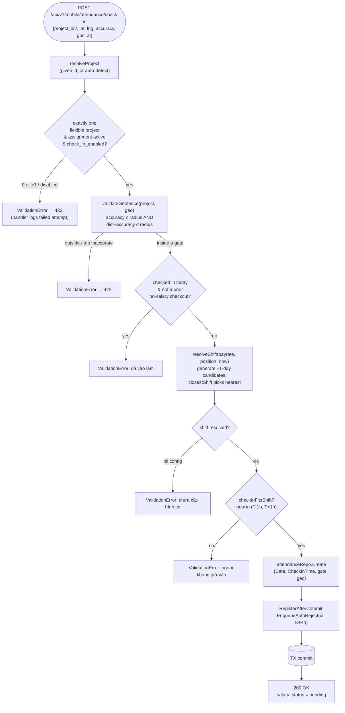
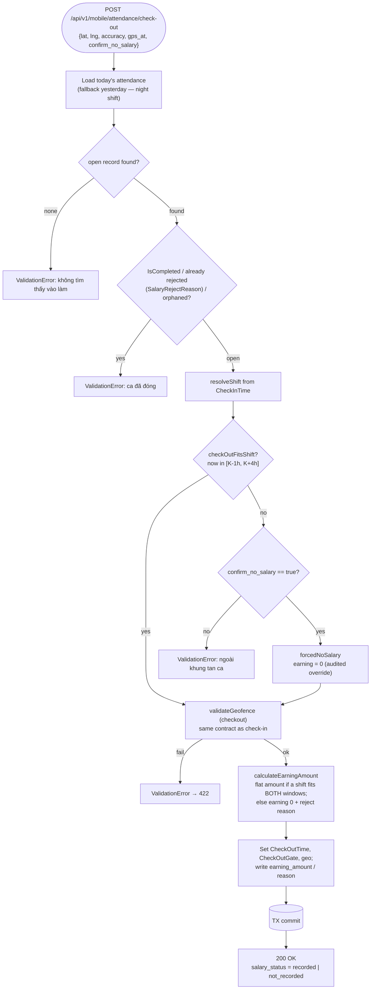
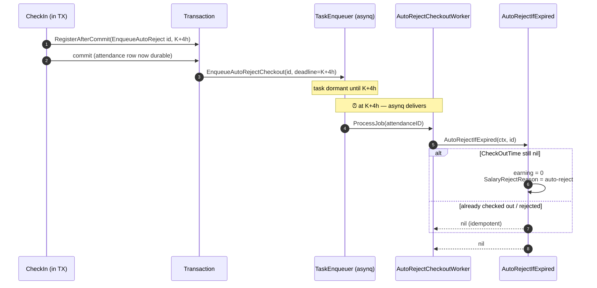
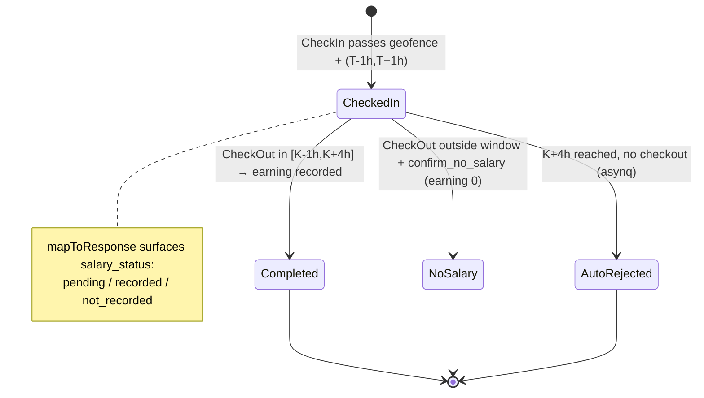

# Visual Explanation: Check-In / Check-Out Flow

> Self-checkin attendance for **flexible** projects. Employee uses the mobile app
> to check in at a gate, work their shift, and check out — earning a flat per-shift
> wage only when both the check-in and check-out land inside configured windows.
> Source of truth: `backend/internal/app/services/attendance/attendance_service.go`
> (values below reflect the current working tree, where `checkOutUpperGrace = 4h`).

## Overview

The flow spans four layers, plus an asynchronous safety net:

| Layer | Component | Role |
|---|---|---|
| Mobile | `EmployeeCheckInCard`, `geolocation.ts` | Capture GPS (watchPosition convergence), POST to API |
| Handler | `attendance.Handler` (`transport/http/handlers/attendance/attendance.go`) | Resolve `Employee.ID` from JWT, build `GeoReading`, map response, log failed attempts |
| Service | `attendance.AttendanceService` | Business rules: project, geofence, shift, windows, earning, auto-reject scheduling |
| Async | `AutoRejectCheckoutWorker` (asynq) | At K+4h, reject shifts left open with no checkout |

**Time anchors (the whole flow is built on these):**
- **T** = configured shift **start**
- **K** = configured shift **end**
- All times via `clock.Now()` in `Asia/Ho_Chi_Minh` (`time.Local`).

## Quick View (ASCII)

### Component pipeline

```
 ┌──────────┐  POST /check-in   ┌────────────┐                    ┌──────────────────┐
 │  Mobile  │ ────────────────▶ │  Handler   │ ──service.CheckIn▶ │ AttendanceService│
 │  (GPS)   │ ◀──── 200/4xx ─── │            │                    │  + transaction   │
 └──────────┘                   └────┬───────┘                    └────────┬─────────┘
   watchPosition                     │ recordFailedAttempt                  │
   convergence                (best-effort, fire-and-forget)              │
                                     ▼                                       ▼
                          ┌──────────────────┐   validateGeofence   ┌─────────────┐
                          │ FailedAttemptRepo│ ◀────────────────── │ Project /    │
                          │ (admin dashboard)│                      │ Payrate repos│
                          └──────────────────┘                      └─────────────┘

   On commit ──▶ asynq task scheduled at K+4h ──▶ AutoRejectCheckoutWorker
                                                       │ AutoRejectIfExpired
                                                       ▼
                                          if CheckOutTime == nil → earning 0 + rejected
```

### Time-window timeline (the heart of the flow)

```
              CHECK-IN window            CHECK-OUT window
              (T-1h ──────── T+1h)       [K-1h ──────── K ──────── K+4h]
                      open                         closed

  ─────┬───────┬───────────────┬────────┬────────┬────────┬──────────┬────────▶ time
       T-1h     T              T+1h     K-1h      K        K+?        K+4h
                                                              │
                                          (checkout still allowed anywhere in [K-1h, K+4h])
                                                              │
                                                  auto-reject fires ◀── asynq, only if no checkout
```

- **Check-in** valid strictly inside `(T-1h, T+1h)` — `checkInShiftWindow = 1h`.
- **Check-out** valid across `[K-1h, K+4h]` — `checkOutLowerGrace = 1h`, `checkOutUpperGrace = 4h`.
- A shift **earns** only when the attendance fits **both** windows simultaneously (`calculateEarningAmount` matches a shift satisfying `checkInFitsShift` **and** `checkOutFitsShift`).

## Detailed Flow

### 1. Check-In — `AttendanceService.CheckIn`



### 2. Check-Out — `AttendanceService.CheckOut`



### 3. Auto-Reject safety net — async, fired once at K+4h



### 4. Attendance lifecycle



## Key Concepts

1. **T and K, not wall-clock duration.** There is no "worked N hours" math. Earning is a **flat per-shift amount** from the payrate config; the windows only gate *whether* the shift counts. A checkout the gate accepts is *guaranteed* to earn, because `calculateEarningAmount` reuses the exact same `checkInFitsShift` / `checkOutFitsShift` predicates the gates use.

2. **Geofence accuracy gate (anti-spoof).** `validateGeofence` rejects a fix whose uncertainty circle can't fit inside the gate: `dist + accuracy ≤ radius`. `accuracy > radius` is rejected outright; an on-gate coordinate with low accuracy is held as "inside but uncertain" and rejected. `accuracy == 0` (legacy client, unknown) skips the uncertainty check so legitimate fixes still pass. *(Device-reported GPS can still be spoofed — this only stops sloppy/misreported fixes.)*

3. **Shift resolution uses ±1-day candidates, not a rollback hack.** `resolveShifts` generates each configured shift starting on the day before, the day of, and the day after check-in (cross-midnight aware), then `closestShift` prefers a shift that actually *contains* the check-in before falling back to nearest start. This anchors night shifts and early arrivals (e.g. 19:50 into a 20:00–04:00 shift) to the correct calendar day.

4. **No fallback when config is missing.** If no payrate/position/shift resolves (`shift == nil`), the action is **rejected** — it never silently falls back to a fixed duration. The same is true for a project with no `GeofenceGates`.

5. **One check-in per day — with one escape hatch.** A second check-in is rejected unless the prior record was a *confirmed-no-salary* checkout, in which case the employee may start a fresh shift.

6. **Auto-reject is scheduled, not polled.** The task is enqueued at K+4h inside the check-in transaction but only **after commit** (`RegisterAfterCommit`), so it never fires for a rolled-back check-in. `AutoRejectIfExpired` is idempotent, so asynq retries are safe; a checkout that lands before K+4h makes the task a no-op.

7. **Failed attempts are forensic, never blocking.** When a check-in/checkout fails validation, the handler fire-and-forgets a row to `AttendanceFailedAttemptRepository` (using a detached 3s context so the write survives response cancellation). This feeds the admin **Check-In Health** dashboard; it never changes the response to the employee.

## Code Anchors

| Concern | Location |
|---|---|
| HTTP endpoints + failed-attempt logging | `backend/internal/transport/http/handlers/attendance/attendance.go` (`CheckIn` ~L153, `CheckOut` ~L187, `LogDeviceAttempt` ~L240) |
| Window constants | `attendance_service.go` L18–27 (`checkInShiftWindow=1h`, `checkOutLowerGrace=1h`, `checkOutUpperGrace=4h`) |
| Geofence accuracy gate | `attendance_service.go` `validateGeofence` ~L290 |
| Shift resolution (±1-day candidates) | `attendance_service.go` `resolveShifts` ~L160, `closestShift` ~L237, `resolveShift` ~L267 |
| Check-in / checkout orchestration | `attendance_service.go` `CheckIn` L406, `CheckOut` L501 |
| Earning match (both-window predicate) | `attendance_service.go` `calculateEarningAmount` L897 |
| Auto-reject scheduling | `attendance_service.go` ~L482 (`RegisterAfterCommit` → `EnqueueAutoRejectCheckout`) |
| Auto-reject worker | `backend/internal/app/workers/auto_reject_checkout_worker.go` (`AutoRejectCheckoutWorker.ProcessJob`) |
| Salary-status response mapping | `attendance.go` `mapToResponse` ~L115 |
