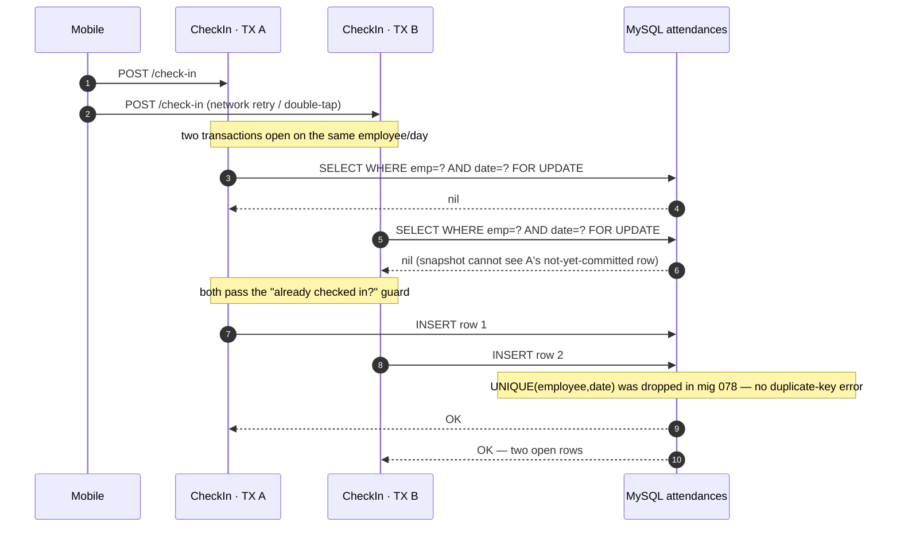
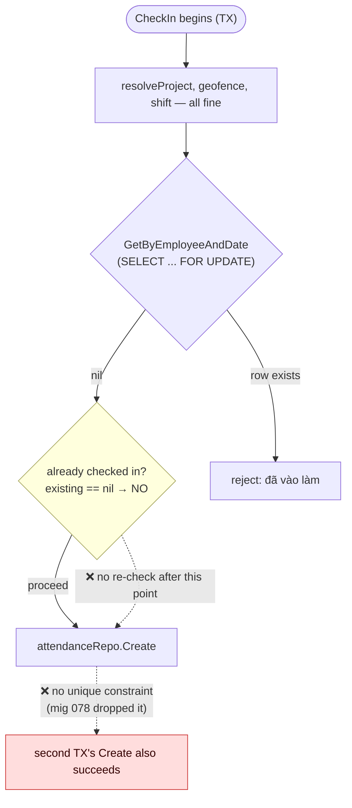

# Visual Explanation: The Duplicate Check-In Race (TOCTOU)

> The `CheckIn` flow has a **time-of-check-to-time-of-use (TOCTOU)** gap. Two
> concurrent check-ins for the same employee on the same day can both pass the
> "already checked in?" guard and both insert — producing **duplicate open
> attendance rows**. Migration 078 removed the only thing that used to stop it.
> Confirmed by a passing reproduction test:
> `backend/internal/app/services/attendance/attendance_checkin_concurrency_test.go`.

## Overview

The guard in `CheckIn` is a classic read-then-write:

```
1. read   GetByEmployeeAndDate(employee, today)   →  nil?
2. write  attendanceRepo.Create(...)                 →  new row
```

Between step 1 and step 2 there is **no serialization** — no held lock, no
re-check, no unique constraint. If a second check-in reads between A's read and
A's write, it also sees `nil`, and both go on to create.

The guard **used to be backed by the database**: migration `067` declared
`UNIQUE uq_employee_date (employee_id, date)`. Migration `078` **dropped it**
(replaced with a non-unique index) so an employee can re-check-in after a
confirmed-no-salary checkout — a legitimate need, but it threw out the only
declarative backstop. The invariant now lives only in application code that
cannot enforce it under concurrency.

## Quick View (ASCII)

### The interleaving (the race window)

```
                         shared "attendances" table
                         ┌──────────────────────────┐
   TX A (req A)          │  (no row for emp/date)   │          TX B (req B, concurrent)
   │                     └──────────────────────────┘             │
   │  ① read FOR UPDATE ──▶ nil                                   │
   │                     (nothing to lock)                        │
   │                              ① read FOR UPDATE ──▶ nil ◀─────│
   │                     (B's snapshot can't see A's               │
   │                      uncommitted/absent row)                  │
   │                                                               │
   │  ② INSERT row 1 ──▶ row 1                                    │
   │                              ② INSERT row 2 ──▶ row 2 ◀──────│
   │                                                               │
                         ❌ both rows persist — no UNIQUE to reject the second
```

### How we got here (migration timeline)

```
mig 067   UNIQUE uq_employee_date (employee_id, date)        ← declarative guard ✓
mig 078   DROP  uq_employee_date                               ← guard removed
          CREATE INDEX idx_attendances_employee_date            (non-unique)
          reason: allow re-check-in after a no-salary checkout
```

### Consequence (bounded, but real)

```
   2 open rows for one employee/day
            │
            ▼
   CheckOut picks ONE  (GetByEmployeeAndDate: open-first, id DESC)
            │
            └──▶ the other row stays OPEN
                        │
                        ▼
                 auto-reject @ K+4h  →  earning 0 + rejected
                        │
                        ▼
   ✅ money does NOT double
   ❌ 1-check-in/day invariant broken
   ❌ spurious "rejected" attendance in payroll + health dashboard
   ❌ the K+4h auto-reject asynq task double-fires
```

## Detailed Flow (Mermaid)

### The race — two concurrent transactions



### Where serialization is missing



## Key Concepts

1. **It's a TOCTOU, not a logic bug.** The guard is correct *sequentially* — a second check-in after a committed first one is rejected, because by then the row exists and `FOR UPDATE` locks it. The gap is purely the concurrent first-check-in window.

2. **`FOR UPDATE` does not save it.** It only locks **rows that match**. When no row exists yet, there's nothing to lock:
   - Under MySQL **READ COMMITTED**: no gap locks → both selects return nil immediately → both inserts succeed. Certain duplicate.
   - Under MySQL default **REPEATABLE READ** + the `(employee_id, date)` index: `FOR UPDATE` places a *gap lock* that **delays** B's insert until A commits — but B's snapshot already returned nil, so B proceeds to insert after A commits. The gap lock *serializes timing*, it does not *prevent* the duplicate. No unique constraint ⇒ no duplicate-key error ⇒ **both rows persist**.

3. **Why the unique was removed.** Re-check-in after a *confirmed-no-salary* checkout requires a second row for the same `(employee, date)`. The old `UNIQUE(employee_id, date)` forbade that. So a naïve restore would break that feature. The fix needs to constrain only **open** rows.

4. **The check-out side is safe by ordering.** `GetByEmployeeAndDate` orders `open-first, id DESC`, so checkout and earning target exactly one record. That's why this is *reporting/invariant* noise, not double-pay.

5. **The reproduction is deterministic.** The test injects the interleaving with a barrier fake repo (both reads resolve before either write) and asserts `created == 2`. It is a **passing** test that documents the bug in CI; once fixed it should assert at-most-one.

## Code Anchors

| Concern | Location |
|---|---|
| Read-then-write guard | `attendance_service.go` `CheckIn` ~L435 (`GetByEmployeeAndDate`) → ~L474 (`Create`) |
| Row lock + open-first ordering (why checkout is safe) | `attendance_repository.go` `GetByEmployeeAndDate` L59-67 |
| Original unique constraint | `migrations/067_add_flexi_checkin_fields.up.sql:24` (`UNIQUE KEY uq_employee_date`) |
| Unique dropped (guard removed) | `migrations/078_allow_attendance_recheckin_after_no_salary_checkout.up.sql:4-5` |
| Reproduction test | `backend/internal/app/services/attendance/attendance_checkin_concurrency_test.go` |

## Fix direction (for the next step — not applied)

A **partial unique** on "open" rows only, via a stored generated column — closed/rejected rows get `NULL` (MySQL allows multiple NULLs in a unique index), so re-check-in still works while at most one **open** row is enforced declaratively:

```sql
ALTER TABLE attendances
  ADD COLUMN open_key DATE GENERATED ALWAYS AS
    (CASE WHEN check_out_time IS NULL AND salary_reject_reason IS NULL THEN date ELSE NULL END) STORED;
ALTER TABLE attendances
  ADD UNIQUE KEY uq_attendances_employee_open (employee_id, open_key);
```

The losing `Create` returns a duplicate-key error; map that to the friendly "Bạn đã vào làm trong ngày hôm nay rồi" message, and invert the reproduction test to assert at-most-one `Create`.
